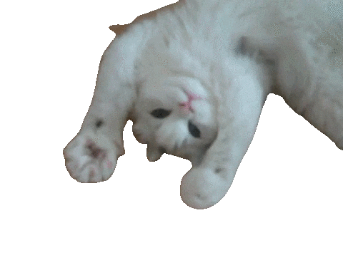

    

### 👨🏻‍💻 &nbsp;About Me

- 🎓 &nbsp;Currently, pursuing my academic journey in Statistics.
- 🌱 &nbsp;I'm enthusiastic about learning Artificial Intelligence and Systems Design.
- 💬 &nbsp;Feel free to reach out to me for any consulting or volunteering opportunities, or simply for interesting discussions.
- ✉️ &nbsp;You can contact me via email at mrinalvbu@gmail.com. I'll do my best to respond promptly.

 
### 🛠 &nbsp;Tech Stack

&nbsp;
&nbsp;
)&nbsp;\

&nbsp;
&nbsp; 
 

### 🤝🏻 &nbsp;Connect with Me

 

 

    
    
    
    
    
    
    
    
    
    
    
    
    
    
    
    
    
    
    
    
    
    
    
    

 

    

